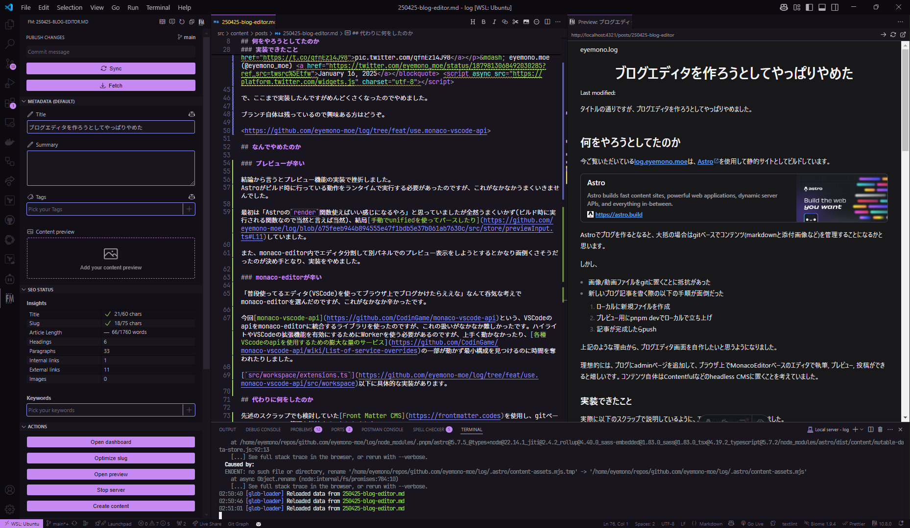

タイトルの通りですが、ブログエディタを作ろうとしてやっぱりやめました。

## 何をやろうとしてたのか

今ご覧いただいている[log.eyemono.moe](/)は、[Astro](https://astro.build)を使用して静的サイトとしてビルドしています。

<https://astro.build>

Astroでブログを作るとなると、大抵の場合はgitベースでコンテンツ(markdownと添付画像など)を管理することになるかと思います。

しかし、

- 画像/動画ファイルをgitに置くことに抵抗があった
- 新しいブログ記事を書く際の以下の手順が面倒だった
  1. ローカルに新規ファイルを作成
  2. プレビュー用にpnpm devでローカルで立ち上げ
  3. 記事が完成したらpush

上記のような理由から、ブログエディタ画面を自作したいと思うようになりました。

理想的には、ブログにadminページを追加して、ブラウザ上でMonacoEditorベースのエディタで執筆, プレビュー, 投稿ができると嬉しいです。コンテンツ自体はContentfulなどのheadless CMSに置くことを考えていました。

### 実装できたこと

実際に以下のスクラップで説明しているように、エディタの実装は6割程できました。

<https://zenn.dev/eyemono_moe/scraps/646558f4390ac5>

詳細はスクラップを確認してもらうとして、ざっくりと何をしたか説明するとこんな感じです。

- Contentful用の[Content Loader](https://docs.astro.build/en/reference/content-loader-reference/)を実装
- Clerkで認証してエディタ(admin画面)へのアクセスを制限
- [monaco-vscode-api](https://github.com/CodinGame/monaco-vscode-api)を使用して、VSCodeとほぼ同じ動作をするエディタを実装
- リモート(Contentful)のコンテンツとローカルのコンテンツの差分表示, 変更のアップロード機能
  - VSCodeのSource Controlと同じ動作
- クリップボードからの画像アップロード
  - 画像もContentfulにアップロードできるようにしていました

<blockquote class="twitter-tweet">
Astroで作ったブログにadminページ追加して、CMS(Contentful)に置いてる記事内容をブラウザ内MonacoEditorで編集できるようにしてみている remoteとのdiff表示とかまで実装できた 後は実際に編集を反映する部分とかやっていく <a href="https://t.co/qfnEz14J98">pic.twitter.com/qfnEz14J98</a>
&mdash; eyemono.moe (@eyemono_moe) <a href="https://twitter.com/eyemono_moe/status/1879813068492030285?ref_src=twsrc%5Etfw">January 16, 2025</a></blockquote> 

で、ここまで実装したんですがめんどくさくなったのでやめました。

ブランチ自体は残っているので興味ある方はどうぞ。

<https://github.com/eyemono-moe/log/tree/feat/use.monaco-vscode-api>

## なんでやめたのか

### プレビューが辛い

結論から言うとプレビュー機能の実装で挫折しました。
Astroがビルド時に行っている動作をランタイムで実行する必要があったのですが、これがなかなかうまくいきませんでした。

最初は「Astroの`render`関数使えばいい感じになるやろ」と思っていましたが全然うまくいかず(ビルド時に実行される関数なので当然と言えば当然)、結局[手動でunifiedを使ってパースしたり](https://github.com/eyemono-moe/log/blob/675feeb944b894555e47f1bdb5e37b061ab7630c/src/store/previewInput.ts#L11)していました。

また、monaco-editor内でエディタ分割して別パネルでのプレビュー表示をしようとするとかなり面倒くさそうだったのが決め手となり、実装をやめました。

### monaco-editorが辛い

「普段使ってるエディタ(VSCode)を使ってブラウザ上でブログかけたらええな」なんて呑気な考えでmonaco-editorを選んだのですが、これがなかなか辛かったです。

今回[monaco-vscode-api](https://github.com/CodinGame/monaco-vscode-api)という、VSCodeのapiをmonaco-editorに統合するライブラリを使ったのですが、これの扱いがなかなか難しかったです。ハイライトやVSCodeの拡張機能を有効にするためにWorkerを使う必要があるのですが、上手く動かなかったり、[各種VScodeのapiを使用するための膨大な量のサービス](https://github.com/CodinGame/monaco-vscode-api/wiki/List-of-service-overrides)の一部が動かず最小構成を見つけるのに時間を奪われたりしました。

[`src/workspace/extensions.ts`](https://github.com/eyemono-moe/log/tree/feat/use.monaco-vscode-api/src/workspace)以下に具体的な実装があります。

## 代わりに何をしたのか

先述のスクラップでも検討していた[Front Matter CMS](https://frontmatter.codes)を使用し、gitベースでのコンテンツ管理を継続することにしました。

Front Matter CMSは、VSCodeの拡張機能として動作するCMSで、コンテンツやメディアの管理ダッシュボードや使いやすい編集インターフェースを提供してくれます。

VSCodeの拡張機能として動作するため、VSCodeのエコシステムをそのまま利用できるのが非常に良いです。ボタン一つでサーバーを立ち上げてプレビューできるので、ローカルでのプレビューも簡単です(自分でコマンド打つのと大差ないと言われたらまあ...そう)。

設定項目が非常に豊富で、僕もまだ全てを把握できていないのですが、front matter編集用のGUIがいい感じに動いてくれたり、本文内容からGithub copilotを使用してtagやtitleを自動生成してくれたりします。

ということで今後も素直にVSCodeを使用してブログを書いていこうと思います。
