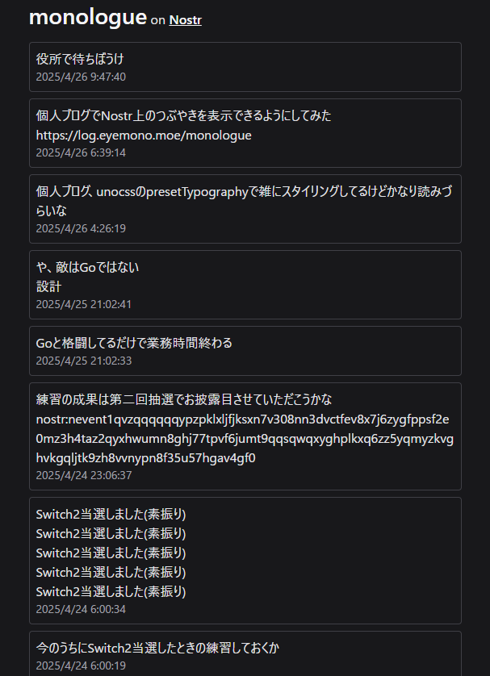

## 動機

[ブログエディタを作ろうとしてやめた話](/posts/250425-blog-editor)と関連するのですが、このエディタ実装作業中は「ブラウザでブログを更新できる仕組みを作れば更新頻度上げられそ～～」という気持ちがありました。結局実装がめんどくさくて却って更新頻度が落ちていたわけですが。

更新ハードルの低いコンテンツって結局Twitterみたいな短文SNSになるわけで、じゃあもうブログに短文SNSを載せようよという気分になり、**Nostr**表示ページを実装しました。

<https://log.eyemono.moe/monologue>

独り言なのでmonologueです。"eyemono.blog"にせず"eyemono.log"にしていたのはこれを考えていたからです。

## 仕組み

Nostrの読取専用クライアントを実装した形になります。

### Nostrとは

Nostrは分散型のSNSプロトコルです。

- Websocketベースの通信
- コミュニティによって管理されており特定団体に依存していない
  - Nostrにイーロンマスクは居ない
- 公開鍵暗号を使用したアカウントシステム
  - 「メールアドレスで登録」みたいな概念が無い

...といった他には無い面白い特徴を持ったプロトコルです。

より詳細なNostrの思想・仕様・利用については[Nostrの面白さをエンジニア目線で解説してみる](https://zenn.dev/mattn/articles/cf43423178d65c)を参照してください。

<https://zenn.dev/mattn/articles/cf43423178d65c>

### 本ブログでの実装

で、僕はこのNostrのクライアントを自作しています。Streetsという名前です。

<https://trap.jp/post/2414/>

<https://streets.eyemono.moe>

このStreetsのコードを流用して、ブログにNostrの投稿を表示するページを作りました。Nostrはデータの読取をするだけならアカウントやAPIキーは不要なため、皆さんはそれがNostrであるということを意識せずに僕の投稿を見ることができます。

現在はまだ実装途中で、コンテンツのパースなどしていないため埋め込み画像や引用投稿が表示されていません。この辺りはおいおい実装していく予定です。

コア部分の実装にはStreetsと同様に[rx-nostr](https://github.com/penpenpng/rx-nostr)を使用させていただいています。Nostrのめんどくさい部分を綺麗に隠蔽しており、かつReactiveXの資産を活かせてめちゃくちゃ便利です。

<https://github.com/penpenpng/rx-nostr>

本ブログでの実装部分は <https://github.com/eyemono-moe/log/blob/main/src/components/solid/Monologue.tsx> 辺りにあります。Streetsではキャッシュをしようとしたりして無駄に複雑になっちゃっているんですが、今回は僕の投稿さえ見れればいいので非常にシンプルな実装になりました。

SolidJSでは[from utility](https://docs.solidjs.com/reference/reactive-utilities/from)を使うことで、RxJSでのobservablesを簡単にsignalに変換することができるため、表示部分もシンプルです。

過去投稿のページネーションとかも読めばわかるぐらいのシンプルな実装になっています：<https://github.com/eyemono-moe/log/blob/main/src/utils/nostr/createInfiniteEvent.ts>

---

ということで今後はNostrでの僕の投稿も見てやってください。Twitterがいつ消えるかわからない今、Nostrは面白い選択肢だと思います。
