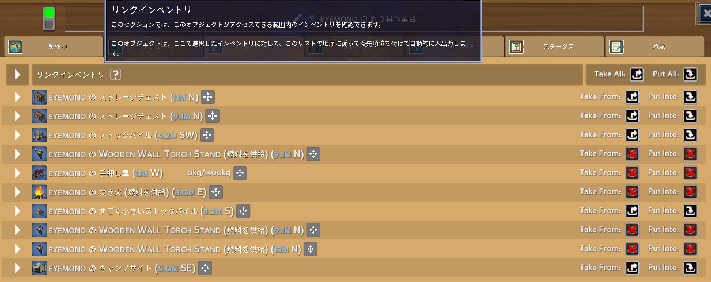

イブラヒムが[Eco](https://store.steampowered.com/app/382310?snr=5000_5100__)の鯖立てると聞いて購入してみた。簡単にゲームシステムをまとめてみます。
私自身まだ10時間程度しかプレイできておらず、クリアまでたどり着けていないので本当に最序盤の内容のみです。誤り等あればご指摘いただけますと幸いです。

<iframe src="https://store.steampowered.com/widget/382310/" frameborder="0" width="864" height="190" style="width:100%;"></iframe>

なお、実際に今回初めてEcoをプレイする方は、最低限[チュートリアル進行不能バグについて](#チュートリアルを完了しないと経験値が解放されない)を確認しておくことをお勧めします。

## どんなゲーム?

めんどくさくなったminecraft。
めんどくさい部分をマルチプレイで解決するのがおもろいゲーム。

## 何をするゲーム?

30日後に隕石が落ちてきて死ぬので、死なないようにみんなで頑張るゲーム。

## システム紹介

まず最初に、**ゲーム内の辞典"Eco PEDIA"(ゲーム内ショートカット <kbd>P</kbd> あるいは画面右下のマップ表示の左下にあるクエスチョンマーク)から、このゲームの仕組み・やるべきことを一通り確認しましょう。**

一旦は"コンセプト"→"はじめに"の内容を確認すれば十分そう。以下主要部分をざっくり抜き出します。

### 目標

30日後に隕石が落ちてくるので、それまでに科学と産業を発展させ、隕石を破壊する装置(レーザー)を作ること。
その過程で、限りある資源が枯渇しないように、生態系を崩壊させないように、行政によるルール作りを行うこと。

### 専門分野と経験値

このゲームの基本は採取とクラフトだが、クラフトには**材料**と**時間**と**労働**が必要。

例えば"丸太材"のクラフトには、1つ当たり以下が必要

- 時間：5秒
- 労働：**木こりレベル1による20の労働**
- 材料：Dowel 1, 木材 1

特に**労働**が重要で、このゲームではアイテムのクラフトのために「特定の職業に就き、一定の専門分野レベルを持ったユーザーによる労働」が必要となっている。前述の丸太材の例では木こりレベル1による労働が必要だったが、例えば木こりレベル6の労働が必要なアイテムを木こりレベル1がクラフトしようとすると、以下のアラートが表示される。

> 木こりレベル6持ってないから、木こりレベル6を持っている誰かに労働してもらう必要があるよ

つまりこのゲームでは、**専門分野を習得し、レベルを上げていくことが非常に重要**となる。で、この専門分野の習得が非常にめんどくさい。ざっくりとまとめると以下の通り。

- 専門分野を習得するには?→スターが必要
- スターを得るには?→キャラクターレベルを上げる必要がある
- キャラクターレベルを上げるには?→キャラクター経験値を得る必要がある
- キャラクター経験値を得るには?→**経験値倍率を高めた上で**、リアル時間経過する必要がある。

キャラクター経験値は(リアルの)時間経過で勝手に増えていくが、この経験値には**経験値倍率**がかかる。リアル時間待つ部分についてはどうしようもないので、**経験値倍率を高めることが重要**になる。経験値倍率を高めるには以下の方法がある。

- 栄養バランスを良くする(後述)
- いい家に住む

ゲーム画面左下に現在の栄養バランスや家の状態が表示され、経験値倍率を確認することができる。

経験値倍率を高めた上でもキャラクターレベルは全然上がらないので、**1人が複数の専門分野を習得することは現実的ではない**。そこで、**各々は自身の専門分野を少なく絞って特化し、他の人と協力してクラフトを行うことが重要になる**。その過程で発生する取引や政治がこのゲームの醍醐味(なんだと思う)。

### もっと細かい専門分野の話：スキルブックについて

専門分野の習得にはスターが必要と前述したが、もっと細かく言うと、"各専門分野のスキルブックを作成・使用して分野を**発見**すると、その専門分野を習得可能になる"。つまりスターを消費して習得する前にもう一段階 発見という壁がある。

ゲーム開始直後から無条件で習得可能(=スター消費可能)な採掘,木こり,採集,狩猟の4分野以外は、まずその分野を発見するための**スキルブック**を作成する必要がある。

例えばティアの高い家を作るのに必須となる**石工**分野を習得するために、まず石工のスキルブックを作成する必要がある。各スキルブックは**リサーチテーブル**という施設で作成可能。この石工のスキルブックのクラフトには"地質学の基礎研究書"と"採集の基礎研究書"が必要だが、これら研究書のクラフトにはそれぞれ"採掘"と"採集"分野を持つユーザーの労働が必要になる。つまり**石工分野を習得するには、まず採掘分野を持つユーザーと採集分野を持つユーザーが必要になる**。

こうしてクラフトできた石工のスキルブックを使用すると、石工分野を"発見"でき、ここからさらにスターを消費して石工分野を習得すると、石工分野のクラフトができるようになる。めんどくせ～～～。

プレイ時間短くてまだ判断できないが、各専門分野の依存関係を考えると、最序盤は全体の専門分野割合が 採集=採掘>=木こり>狩猟 になっていると良さそう。狩猟が多すぎると多分詰む。

### チュートリアルを完了しないと経験値が解放されない

本ゲームを開始すると画面左上にチュートリアルが表示される。これに従って進めれば本記事で説明した内容は一通り確認できるため、初めての方はぜひチュートリアルを完了させましょう。注意点として、**チュートリアルを完了状態にしないと経験値が解放されない**(=専門分野が解放されない)。
チュートリアル表示欄にカーソルを合わせるとスキップボタンが出てくるので、スキップして完了させても問題はないです。

> [!warning] チュートリアル進行不能バグ
> **チュートリアルが進行不能になるバグがあります**。具体的には以下を確認しています。
>
> - チュートリアルで"土地を9か所以上耕す"が表示される前に先走って土地を耕すと、耕した判定がうまく実行されず、何度耕しても"土地を9か所以上耕す"がクリアされなくなる
>   - 対処法：一度耕してしまった土地をシャベルで掘り返して全て元に戻し、再度耕す
>     - "耕された土地の数が9個以上であるか"ではなく、"耕された土地の数が9個になった"を判定に使っていそうな挙動
> - チュートリアルで"種を9個以上植える"が表示される前に先走って種を植えると、植えた判定がうまく実行されず、何度植えても"種を9個以上植える"がクリアされなくなる
>   - 対処法：自分は解決しなかったのでワールド消してやり直しました:bomb:
>
> どうしても解決しない場合はスキップしちゃいましょう。
> あとチュートリアル関係ないけど採掘してたら突然地中にワープして二度と地表に戻れなくなったデータもあった。これもワールド消してやり直しました:bomb:

### 食料・栄養

このゲームでは何をやるにも**カロリー**(いわゆるスタミナ)が必要。「空腹すぎて実行できません」と表示されたらカロリーが足りていない状態。

カロリーを確保するには食料を食べる必要がある。各食糧には**カロリー**と**栄養**が設定されており、食料を食べるとカロリーと栄養が補給される。

例えば焦げた肉には以下が設定されている。

- カロリー：400
- タンパク質：5.0
- 脂質：10.0

栄養素はCarbs(炭水化物), タンパク質, 脂質, ビタミンの4種類存在し、自身の現在の栄養バランスは常に画面左下に円グラフで表示されている。(円の半径はカロリーを表している)

**この4栄養のバランスが良いほど経験値倍率が高くなる**ので、栄養バランスを意識して食事を摂ることが重要になる。

### ハウジング

良い家に住むほど経験値倍率が高くなる。ハウジング始めるころにはゲームシステムも理解できていると思うので、詳細は割愛。
家具それぞれにカテゴリが設定されており、例えばバスルームカテゴリの家具を置くとその部屋はバスルーム判定になり、デコレーション, 椅子, ライティングカテゴリの家具からの"価値"を取得でき...とかいろいろある。

### リンクインベントリ

クラフト施設では、**近くにある**チェストや倉庫などのアイテムを自動的に参照してクラフトを行うことができる。実際に何ブロック範囲内のアイテムを参照できるかは調べられていないが、施設の"ストレージ"タブから"近くにある"施設のイベントリを確認できる(リンクインベントリと呼ぶらしい)。

ちなみにリンクインベントリ内のアイテムも取得/格納できるので、少し離れた位置にある施設内のアイテムにアクセスしたい場合は、近くの施設のリンクインベントリ欄から参照すればよい。ちょっと重要なテクニック。

### その他

土地の所有とか行政とかお店とかできることはまだまだまだまだたくさんある。が、ソロプレイではあまり扱わなかったため紹介できない。だれかマルチやろう。

## 最序盤やるべきこと

1. テント設置
2. 木材10個確保
3. 作業台作成
4. 作業台でストックパイル作成
    - Ecoには各ユーザーのインベントリに入れられるアイテムと、倉庫系の施設にしか入れられないアイテムがある。木材や石材など多くのクラフトで必要な資材は後者の倉庫系施設に入れる必要があり、最初にストックパイルを作成しておくと良さそう。
5. 食料集めつつ拠点づくり開始
    - ハウジングするためにそこそこの開けた土地が欲しい。本ゲームのハウジングでは家具それぞれに"占有面積"みたいな値が設定されていて、物理的に設置できる面積とは別に、**その部屋に置ける家具の占有面積の合計が、その部屋の面積以下である必要がある**。要するにぎちぎちに家具を詰め込むことはできない。余裕を持った土地を確保しておくと良さそう。
6. どの専門分野を伸ばすか決める

## 迷ったときに見るべきもの

- ゲーム内の辞典(Eco PEDIA)：ゲーム内ショートカット <kbd>P</kbd> あるいは画面右下のマップ表示の左下にあるクエスチョンマーク
- Wiki：<https://wiki.play.eco/en/Getting_Started>

## その他の注意点

- <kbd>Esc</kbd>で開ける設定画面内の"アバター"タブを開くと、設定によっては**Webカメラの映像が画面に表示されてしまう**。配信している人は要注意。
