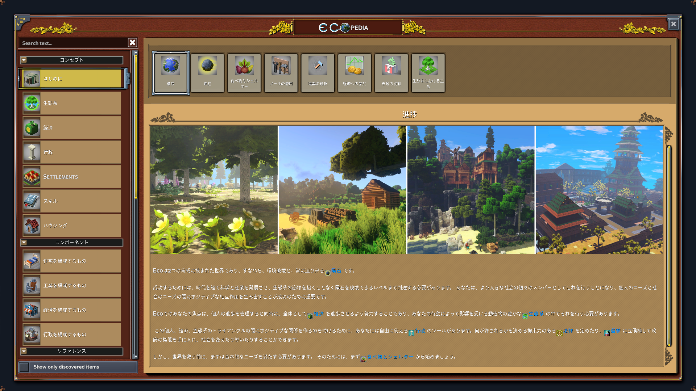
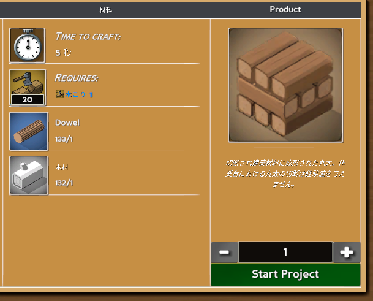
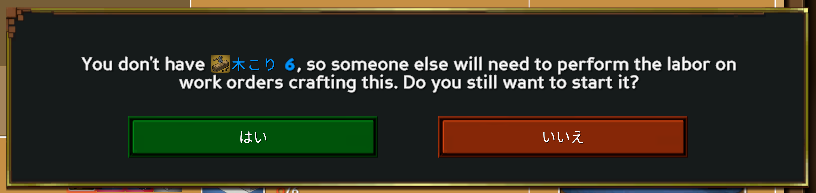
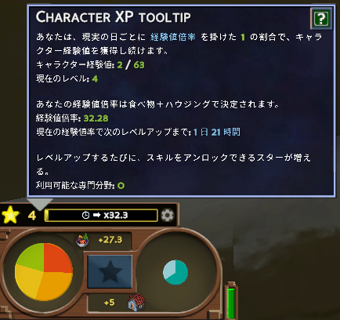
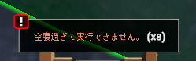
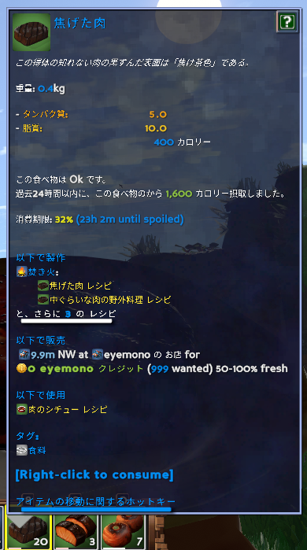
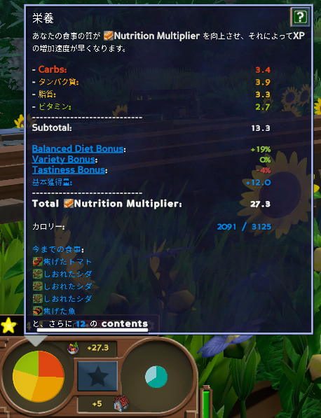

イブラヒムが[Eco](https://store.steampowered.com/app/382310?snr=5000_5100__)の鯖立てると聞いて購入してみた。簡単にゲームシステムをまとめてみます。
私自身まだ10時間程度しかプレイできておらず、クリアまでたどり着けていないので本当に最序盤の内容のみです。誤り等あればご指摘いただけますと幸いです。

<iframe src="https://store.steampowered.com/widget/382310/" frameborder="0" width="864" height="190" style="width:100%;"></iframe>

## どんなゲーム?

めんどくさくなったminecraft。
めんどくさい部分をマルチプレイで解決するのがおもろいゲーム。

## 何をするゲーム?

30日後に隕石が落ちてきて死ぬので、死なないようにみんなで頑張るゲーム。

## システム紹介

まず最初に、**ゲーム内の辞典"Eco PEDIA"(ゲーム内ショートカット <kbd>P</kbd> あるいは画面右下のマップ表示の左下にあるクエスチョンマーク)から、このゲームの仕組み・やるべきことを一通り確認しましょう。**

一旦は"コンセプト"→"はじめに"の内容を確認すれば十分そう。以下主要部分をざっくり抜き出します。

### 目標

30日後に隕石が落ちてくるので、それまでに科学と産業を発展させ、隕石を破壊する装置(レーザー)を作ること。
その過程で、限りある資源が枯渇しないように、生態系を崩壊させないように、行政によるルール作りを行うこと。

### 専門分野と経験値

このゲームの基本は採取とクラフトだが、クラフトには**材料**と**時間**と**労働**が必要。

例えば"丸太材"のクラフトには、1つ当たり以下が必要

- 時間：5秒
- 労働：**木こりレベル1による20の労働**
- 材料：Dowel 1, 木材 1

特に**労働**が重要で、このゲームではアイテムのクラフトのために「特定の職業に就き、一定の専門分野レベルを持ったユーザーによる労働」が必要となっている。前述の丸太材の例では木こりレベル1による労働が必要だったが、例えば木こりレベル6の労働が必要なアイテムを木こりレベル1がクラフトしようとすると、以下のアラートが表示される。

> 木こりレベル6持ってないから、木こりレベル6を持っている誰かに労働してもらう必要があるよ

つまりこのゲームでは、**専門分野レベルを上げていくことが非常に重要**となる。で、この専門分野レベルを上げるのが非常にめんどくさい。ざっくりとまとめると以下の通り。

- 専門分野レベルを上げるには?→スターが必要
- スターを得るには?→キャラクターレベルを上げる必要がある
- キャラクターレベルを上げるには?→キャラクター経験値を得る必要がある
- キャラクター経験値を得るには?→**経験値倍率を高めた上で**、リアル時間経過する必要がある。

キャラクター経験値は(リアルの)時間経過で勝手に増えていくが、この経験値には**経験値倍率**がかかる。要するに、リアル時間待つ部分についてはどうしようもないので、**経験値倍率を高めることが重要**になる。経験値倍率を高めるには以下の方法がある。

- 栄養バランスを良くする(後述)
- いい家に住む

ゲーム画面左下に現在の栄養バランスや家の状態が表示され、経験値倍率を確認することができる。

経験値倍率を高めた上でもキャラクターレベルは全然上がらないので、**1人が複数の専門分野を持つことは現実的ではない**。そこで、**各々は自身の専門分野を少なく絞って特化し、他の人と協力してクラフトを行うことが重要になる**。その過程で発生する取引や政治がこのゲームの醍醐味(なんだと思う)。

### 食料・栄養

このゲームでは何をやるにも**カロリー**(いわゆるスタミナ)が必要。「空腹すぎて実行できません」と表示されたらカロリーが足りていない状態。

カロリーを確保するには食料を食べる必要がある。各食糧には**カロリー**と**栄養**が設定されており、食料を食べるとカロリーと栄養が補給される。

例えば焦げた肉には以下が設定されている。

- カロリー：400
- タンパク質：5.0
- 脂質：10.0

栄養素はCarbs(炭水化物), タンパク質, 脂質, ビタミンの4種類存在し、自身の現在の栄養バランスは常に画面左下に円グラフで表示されている。(円の半径はカロリーを表している)

**この4栄養のバランスが良いほど経験値倍率が高くなる**ので、栄養バランスを意識して食事を摂ることが重要になる。

### ハウジング

良い家に住むほど経験値倍率が高くなる。ハウジング始めるころにはゲームシステムも理解できていると思うので、詳細は割愛。
家具それぞれにカテゴリが設定されており、例えばバスルームカテゴリの家具を置くとその部屋はバスルーム判定になり、デコレーション, 椅子, ライティングカテゴリの家具からの"価値"を取得でき...とかいろいろある。

### その他

土地の所有とか行政とかお店とかできることはまだまだまだまだたくさんある。が、ソロプレイではあまり扱わなかったため紹介できない。だれかマルチやろう。

## 迷ったときに見るべきもの

- ゲーム内の辞典(Eco PEDIA)：ゲーム内ショートカット <kbd>P</kbd> あるいは画面右下のマップ表示の左下にあるクエスチョンマーク
- Wiki：<https://wiki.play.eco/en/Getting_Started>
