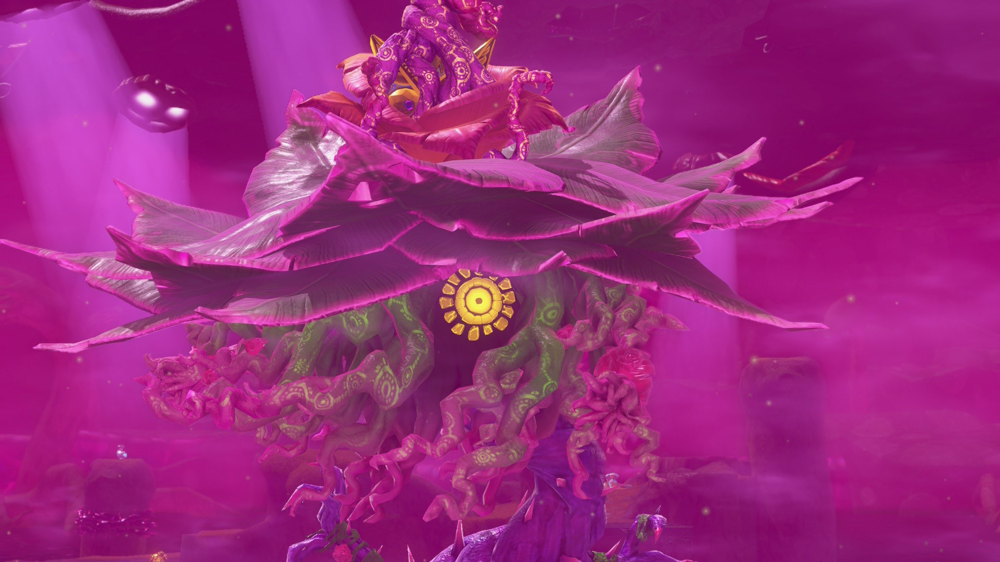

最近遊んで面白かったゲームのメモ。「これを見ているお前！！！！プレイしろ！！！！！！」っていう記事ではなく、「ここに記載しているタイプのゲームが好きなので、似たゲームがあったら教えてくれ！！！！」っていう記事。

ゲームレビューではない(誰かに読んでもらうことを想定した書き方ではない)。自分が何でできているか覚えておくためのメモ。

## Outer Wilds

<iframe src="https://store.steampowered.com/widget/753640/" frameborder="0" width="646" height="190" style="width:100%;"></iframe>

数年前に購入した後一切起動していなかったゲーム。7月に入ってからにじさんじの[石神のぞみ](https://www.youtube.com/@IshigamiNozomi)がこのゲームの配信を始めたことでYouTubeのおすすめに流れてくるようになり、切り抜きのサムネでネタバレを食らう前にクリアしようと思い立ち起動。ネタバレ厳禁ゲームであることだけ知っていて、それ以外の情報は一切知りませんでした。

繰り返されるタイムループの中で世界の謎を解き明かすゲーム。
「各所にある"謎"を少しずつ解き明かして、次の"謎"に進む」という体験がずっと続くゲームで、中だるみみたいなものを感じなかったのが良かった。最初から最後までずっと探検に夢中になれて楽しかった。

## ドンキーコング バナンザ

<https://www.nintendo.com/jp/games/switch2/aaaca/index.html>

とりあえずSwitch2のゲームは一通りやるかと思い、購入。ドンキーコングシリーズはあまり通ってなくて、Wiiでドンキーコングリターンズだけやってた。

良くも悪くも任天堂のゲームだな～って感じ。
壊す→見つける→壊すの繰り返しによる誘導が上手で、ストレスなく進めた。
破壊による爽快感を感じる場面より、毒や棘に触れないよう慎重に進む緊張感のある場面が多かった印象(それはそれでドンキーコングっぽいのかも?)。でもラスボスは爽快感あって良かった。

アブラカジャブラがめちゃかわいい、もはや性的だった。

一番好きなポケモンはユレイドルです。覚えて帰ってください。

## 文字遊戯

<iframe src="https://store.steampowered.com/widget/2343610/" frameborder="0" width="646" height="190" style="width:100%;"></iframe>

Steam版のリンクを貼りましたが自分はSwitch版をプレイしました。中国語版が話題になったときに認知はしていマしたが、[まさかさらっと配信開始されるとは思わなかった](https://www.youtube.com/live/QFiuI4l2KII?si=P68HBbhE-GCbRHSd&t=367)。

ぶっ通しでプレイしちゃったけどぶっ通しでプレイするボリュームではなかった。このテーマでよくそんなにシーンを作れるなと感心する程にはボリュームもあって満足感高め。
終盤の展開も個人的にはすき。
めっちゃ目が疲れるゲームなのでぶっ通しでプレイすべきではない。

## Öoo

<iframe src="https://store.steampowered.com/widget/2721890/" frameborder="0" width="646" height="190" style="width:100%;"></iframe>

未だに読み方わかってない。

"爆発→吹っ飛ぶ"のルールで進んでいくパズルゲーム。知識のメトロイドヴァニアとでも言うべきゲームで、進み方を学んで進むゲーム。
パズル自体のクオリティが高いのもちろんだけど、BGMがかなり良かった。自分はパズルゲームをする時に集中するためにBGMの音量を下げてしまいがちだけど、このゲームでは下げなかった。

そういえばLeap YearのDLC遊んでないの思い出した。今度やるか。

## ペルソナ5 ザ・ロイヤル

<iframe src="https://store.steampowered.com/widget/1687950/" frameborder="0" width="646" height="190" style="width:100%;"></iframe>

「実はペルソナシリーズ通ってないんだよな～」をスマブラジョーカー参戦の頃からずっと胸に秘めつつ、ふと気が向いて購入。女神転生は3DSでめっちゃやってた。

キャラ良し音良しシナリオ良し戦闘良しでとにかくよかった。3学期の蛇足感はありつつも、11月後半の展開はアツかった。起承転結ってやっぱり大事ですね。メインシナリオにおけるセリフ回しがかっこよくて、都度感動していた。
戦闘もあまり単調にはならず、最後までそこそこ頭を使った戦闘ができた。オクムラパレスのボスとか。

周回前提っぽいゲームのわりに肝心なところでセーブができなかったのが不満点。ハワイ/クリスマスイベントを全キャラ分見たいのに直前でセーブできなくて厳しかった。
あと芳澤は眼鏡かけて髪下ろした方が絶対かわいいのに最後また眼鏡外して髪結んでたのも不満点です。

でも本当に面白かった。プレイして良かったと思えるゲームだった。ドラクエXIをプレイしたときにも感じたことだけど、RPGは魅力的なキャラが居るかどうかが結構重要だなと感じる。や、どのゲームでも大事か。マルティナすき。ペルソナ４ リバイバルも出るらしいし発売前にペルソナ３ リロードもやろうかな。

あとドーナドーナってマジでペルソナ5だったんだなと思った。これを見ているお前！！！！ドーナドーナはプレイしろ！！！！！！
