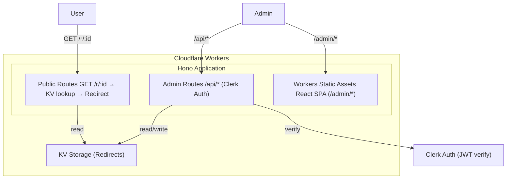
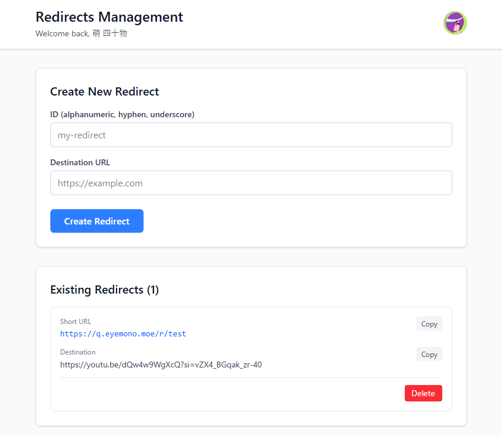

先日FFの以下のようなツイートを見かけました。

<blockquote class="twitter-tweet">
私、魔女のキキです こっちはQRコードを直リンにしたらサ終して全部使えなくなった100枚の名刺 <a href="https://t.co/Lks2GSsM7u">pic.twitter.com/Lks2GSsM7u</a>
&mdash; かろっく (@calloc134) <a href="https://twitter.com/calloc134/status/2023984768111579181?ref_src=twsrc%5Etfw">February 18, 2026</a></blockquote> 

私はまだ名刺を自作したことが無く、幸い印刷物が全部死ぬみたいな経験はしたことがありません。
しかし、普段イベント参加時などにQR印刷・利用している[自己紹介ページ](https://card.eyemono.moe)で似たような経験をしています。
この名刺ページには、クエリパラメータを使ったちょっとしたギミックを入れています。

<blockquote class="twitter-tweet">
NFCタグ、普段名刺ページに飛ばせるようにしてるんだけど、ついでにクエリパラメータ使って「いつどこであったか」も表示できるようにしてる localStorageに保存してるから2回目以降に名刺ページ開いたときも初めて会った場所が見れるようになってます<a href="https://t.co/zLPHnqb8mq">https://t.co/zLPHnqb8mq</a> <a href="https://t.co/rPpCbmDmS9">pic.twitter.com/rPpCbmDmS9</a>
&mdash; eyemono.moe (アイモノ) (@eyemono_moe) <a href="https://twitter.com/eyemono_moe/status/1917120195262615801?ref_src=twsrc%5Etfw">April 29, 2025</a></blockquote> 

<https://card.eyemono.moe>

このギミック自体は自分でも気に入っていますが、**イベント毎にクエリパラメータを変える必要があり**、都度印刷内容も変える必要があります...

そこで、いわゆる Dynamic QR codeや可変QRコードと呼ばれる、**URLのリダイレクタ**を自作してみることにしました。
目標は、`https://q.eyemono.moe/r/{任意の文字列}` にアクセスしたとき、対応するURLにリダイレクトするサービスを作ることです。
このサービスを使えば、印刷物には`https://q.eyemono.moe/r/card1`のようなURLを印刷しておくだけで、リダイレクト先のURLは後から自由に変更できるようになります。これで、イベント毎にクエリパラメータを変える対応も簡単になりますし、サ終でQRが使えなくなるリスクも減らせます。

## できたもの

<https://github.com/eyemono-moe/redirector>

以下のような構成で作りました。

- バックエンド
  - **ランタイム**: [Cloudflare Workers](https://workers.cloudflare.com/)
  - **Webフレームワーク**: [Hono](https://hono.dev/)
  - **ストレージ**: [Cloudflare KV](https://developers.cloudflare.com/kv/) - idとURLのペアを保存
  - **認証**: [Clerk](https://clerk.com/) - 管理画面の認証に使用
- フロントエンド
  - **フレームワーク**: React + Vite
  - **状態管理**: [TanStack Query](https://tanstack.com/query/latest) (React Query)
  - **フォーム**: [TanStack Form](https://tanstack.com/form/latest)
  - **バリデーション**: [Valibot](https://valibot.dev)
  - **スタイリング**: [UnoCSS](https://unocss.dev)
- インフラ・ツール
  - **モノレポ**: pnpm workspace
  - **CI/CD**: GitHub Actions
  - **デプロイ**: Cloudflare Workers (wrangler)
  - **静的アセット配信**: Workers Static Assets

実装自体は非常にシンプルで、`/r/:id`でKVからリダイレクト先を取得して302リダイレクトしているだけです。管理用のAPI`/api/*`はClerk認証・認可を付けて、管理画面はWorkers Static AssetsでReact SPAを配信しています。

<iframe frameborder="0" scrolling="no" style="width:100%; height:557px;" allow="clipboard-write" src="https://emgithub.com/iframe.html?target=https%3A%2F%2Fgithub.com%2Feyemono-moe%2Fredirector%2Fblob%2Fmain%2Fpackages%2Fworker%2Fsrc%2Findex.ts&style=github-dark&type=code&showBorder=on&showLineNumbers=on&showFileMeta=on&showFullPath=on&maxHeight=500"></iframe>

これで、印刷物には<https://q.eyemono.moe/r/test>のようなURLを印刷しておくだけで、リダイレクト先のURLは後から自由に変更できるようになりました。めでたしめでたし。

## おまけ

最近印刷物にQRコードを印刷する際は、[QArt Coder](https://research.swtch.com/qr/draw/)を利用して`eyemono.moe`を画像としてQRコードに埋め込んでいます。

<blockquote class="twitter-tweet">
アナログ名刺作るか～と思い手始めにQRコードを生成した <a href="https://t.co/v7Rn7C1pwb">pic.twitter.com/v7Rn7C1pwb</a>
&mdash; eyemono.moe (アイモノ) (@eyemono_moe) <a href="https://twitter.com/eyemono_moe/status/1918097985730461943?ref_src=twsrc%5Etfw">May 2, 2025</a></blockquote> 

このQArt Coderでは、誤り訂正に甘えてただQRコードに画像を重ねるのではなく、リード・ソロモン符号の線形性を利用してデータビットと誤り訂正ビットを数学的に制御し、スキャン可能な*正しい*QRコードとして画像を生成しています。

<https://research.swtch.com/qart>

たとえば先ほどのツイートのQRコードは<https://eyemono.moe/#682681351682682682682682693341341341341341341341341341341275308871389499204715170682682682512210000000337257005097819391211308115980119818823818812812819177257261005084080260080000000000000000000000170>のようなデータを持つQRコードになっており、URLのフラグメント部分を巧みに利用して画像を埋め込んでいます (この画像ではおしゃれのために実は3ドットだけ不正に編集しているので誤り訂正に甘えています)。

この方法の唯一の欠点は、フラグメント部分が不自然に長く、ユーザーが実際に読み込んだ際に違和感があることです。

しかし、今回自作したURLリダイレクタと組み合わせることで、QRコードは`https://q.eyemono.moe/r/test#123456...`のようなURLを持たせ、リダイレクト先をシンプルなURLにすることができます。これで、QRコードにおしゃれに画像を埋め込みつつ、ユーザーに違和感のないURLを提供することができます。

