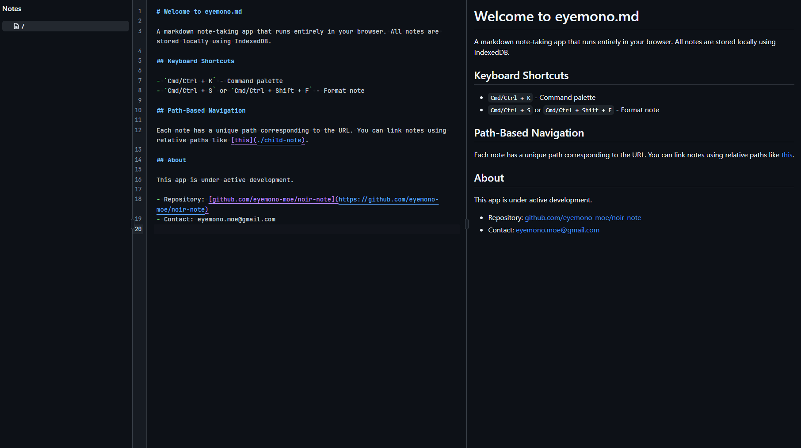
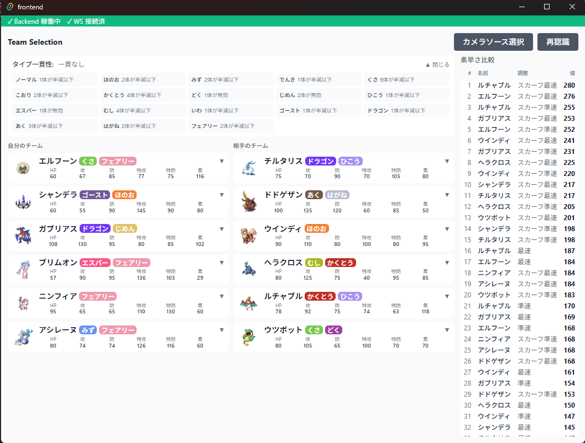
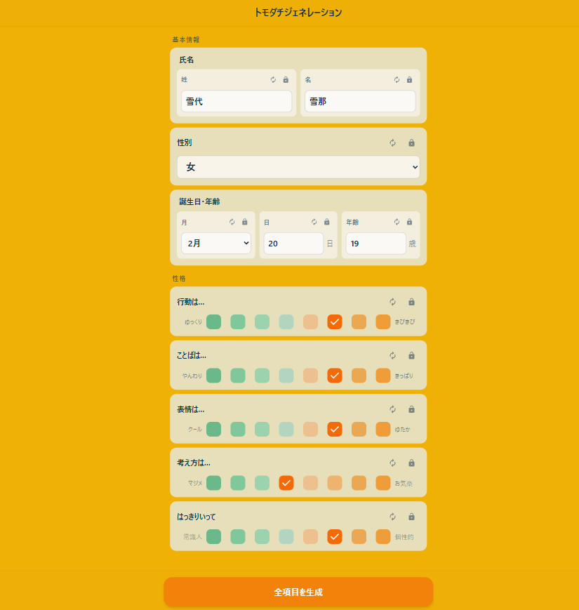
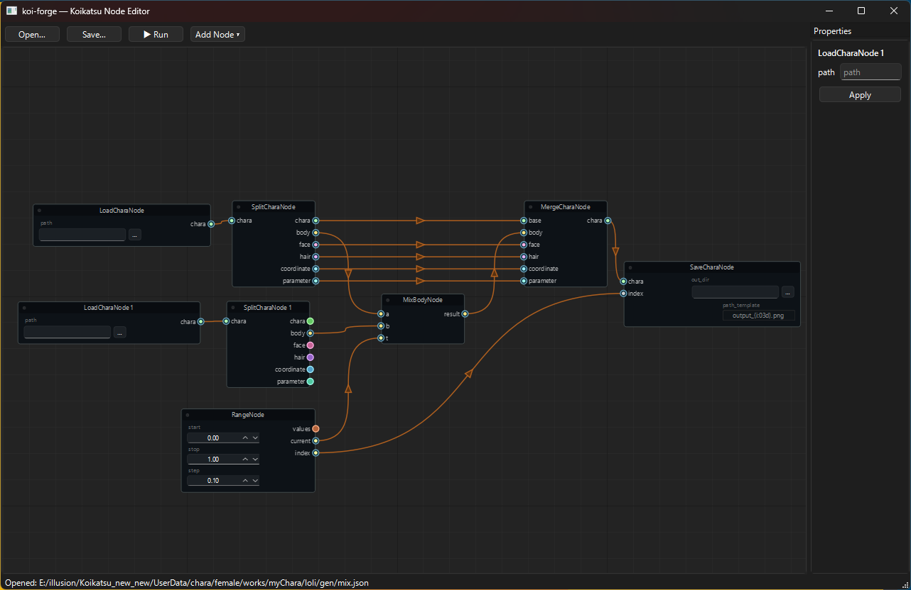

直近２週間で作っていたアプリ4つを自分の整理もかねて簡単にまとめます。本当はそれぞれ別記事にした方がよさそうなんですが面倒なのでまとめちゃいます。技術記事というより単なる日記。

## markdownメモアプリ

<https://md.eyemono.moe/>

<https://github.com/eyemono-moe/noir-note>

ブラウザで動作するメモアプリです。

基本部分は [SolidJS](https://www.solidjs.com)+[CodeMirror](https://codemirror.net)+[Tanstack DB](https://tanstack.com/db/latest) って感じです。

普段メモを取りたいときはブラウザ(Vivaldi)内臓のメモアプリをサイドバーで開いて使っていたのですが、

- 入力欄が狭い
- MarkdownでプレビューできるのにMarkdownの構文が補完されない(Tabでインデントできない)
- 自動整形できない

といった不満があったので自分で作ってみました。HackMDやNotionといった高機能なメモアプリもありますが、とにかく軽くてシンプルなものが欲しかった。特に最近はLLMに渡すプロンプトをパッと下書きするためにメモを開くことが多く、そういう用途にはシンプルな方が向いていると思っていました。

見ての通り、左にファイルツリー、右にエディタとプレビューがあるシンプルな構成です。ファイルはURLと一対一対応しており、ファイル間のリンクも相対リンクで表現できるようになっています。Ctrl+Sでフォーマットで着たり自動補完できたりTabでインデントできたりと、Markdownエディタとしての基本的な機能は一通り備わっています。  
結局のところ欲しかったのはブラウザで動くVSCodeなんだなと思いました。

また、わざわざ自作した背景として、Tanstack DBを使ってみたかったというのもあります。現在メモデータは全てIndexedDBに保存しており、IndexedDB↔[RxDB](https://rxdb.info)↔Tanstack DB↔UIという感じでデータのやり取りを行っています。はじめはIndexedDBに直接アクセスすることを検討していましたが、Tanstack DBを使うことで、データの管理(タブ間同期,Optimistic Updates)がめちゃくちゃ楽になりました。

特にタブ間同期がスムーズにできることで、「OBSのブラウザドックでエディタ表示,配信画面でリアルタイムプレビュー表示」といったことが簡単にできます。たまにOBS内のブラウザソースで動くものを作ることがあるのですが、配信画面内とカスタムドック内でデータを共有するのが地味に面倒だったので、これが簡単にできるのはかなり嬉しいです。

(あまりきれいなコードではないですが)何をやっているかはコードを見ればわかるかと思います。基本的にはIndexedDBおよびRxDBのことは意識せずに、Tanstack DBのAPIを呼び出すだけでメモ作成/更新/削除/取得が簡単にできるようになっています。

まだあまり複雑なことには使っていませんが、今後タグ機能などを実装する際によりTanstack DBの恩恵を受けられるのではないかと思っています。

少し前からNostrのクライアントをTanstackDBベースで作りたいと思いつつ、なかなか着手できていないので、近いうちにそちらも作ってみたいですね。

あとVite+も使っています。なんかもう全部これでいいやという気持ちになっています。VoidZeroいつもありがとう。唯一の不満があるとすれば、`vp create --list`で確認できる`Popular Templates`の中にSolidJSのテンプレートが無いことでしょうか。コントリビュートチャンスかも。

## ポケモンチャンピオンズ選出補助ツール

先日リリースされた[ポケモンチャンピオンズ](https://www.pokemonchampions.jp/ja/)の選出補助ツールです。Switchの画面をキャプチャボード経由で取得し、画面上のポケモンをパターンマッチで認識して、選出の参考になりそうな情報を表示するというものです。

自分はポケモン対戦動画勢で、実際に対戦するのは苦手なのですが、せっかくの新作なので少しぐらいは対戦してみたいなと思い、作ってみました。現在は「各ポケモンの種族値,タイプ表示」「相手パーティのタイプ一貫性確認」「ポケ徹みたいな素早さ比較ツール」だけの簡単なものになっています。

将来的にはAI機能の搭載や技採用率情報との連携なども考えています。

が、実はまだこれ実践投入したことが無く、ボット戦でうまく動いて満足して以降放置している状態です。そもそも利用規約的にこういったツールの利用がセーフかまだ確かめられていない...ので公開もしていません。

技術スタック的には Python + OpenCV & SolidJS on tauri って感じです。Pythonで画面キャプチャと画像処理を行い、SolidJSでUIを作成してtauriでデスクトップアプリ化しています。
今思えばこの程度のUIなら全部Pythonで完結させても良かったかも。普段Webばかりやっていてネイティブアプリの開発に慣れていないので、ベストプラクティスがあまりわかっていなかったのですが、それでもある程度動くものが作れてしまいました。AIこわい。

## トモダチジェネレーション

<https://tomodachi-generation.eyemono-moe.workers.dev>

こちらもまた先日リリースされた[トモダチコレクションの新作](https://www.nintendo.com/jp/switch/blfga/index.html?srsltid=AfmBOoq3008tJOfrkvga5mNOUfYYdP0WypiMJ1jfn7GJMDDOm-R_kyRV)のトモダチ作成補助ツールです。

各パラメータをランダムに生成するだけのシンプルなツールです。将来的には外見の特徴などもランダムに生成できるようにしたい。

私は友達の代わりに架空の女の子を大量にぶち込んでその生活を鑑賞する目的でトモコレを購入したのですが、その際に性格や名前を決めるのが面倒だったので作りました。初代トモコレの頃はちゃんと友達を作っていたのに、俺はいつからこうなってしまったんだ。

## コイカツキャラデータ編集用ノードエディタ

こちらも先日リリース...ではなく、2018年にリリースされたコイカツのキャラデータ編集用ノードエディタです。コイカツについての詳しい説明は割愛しますが(ほぼトモコレみたいなゲームです)、要はキャラメイクゲームのキャラデータをノードベースで編集するためのツールです。

このゲームではキャラクターの顔パーツや体型パーツなどの各種パラメータを細かく調整できるのですが、一括で複数のキャラクターを作ろうと思うと、これがなかなか面倒だったりします。そこで、各パラメータをノードエディタで操作できるようにしてみました。たとえば ランダムに値を生成するノードと、パラメータの線形補完を行うノードを組み合わせることで、やせ型キャラデータとぽっちゃりキャラのデータから、ランダムな中間体型データを簡単に生成できるようになっています。iterator的な振る舞いをするノードもあるので、これを使えば複数のキャラデータを一括で生成することもできます。

BlenderやPixelComposerなどノードベースのツールが好きで、数年前から構想していたアプリだったのですが、UI層が<https://github.com/jchanvfx/NodeGraphQt>でかなり簡単に作れそうだとわかったので、今回作ってみました。キャラデータの読み込みには<https://github.com/great-majority/KoikatuCharaLoader>を使用させていただいています。

まだまだ機能的に不十分であり、UIもあまり洗練されていないため公開はしていませんが、ある程度使える状態になったら公開したいと思っています。需要があるかはわかりませんが、MODデータ周りもいじれるようになったらそこそこ便利そうです。

---

以上、最近作っていたアプリの簡単な紹介でした。どれもまだまだ発展途上ですが、隙間時間で少しずつ機能追加していきたいと思います。学生の頃は(というか休学していた頃は)無限に時間がありましたが、社会人になってからはなかなかまとまった時間が取れないので、こういった趣味開発も少しずつ進めていくスタイルになりそうです。とはいえ2週間でこれだけ作れたのはなかなか良いペースだと思うので、今後もこの調子で色々作っていきたいですね。
