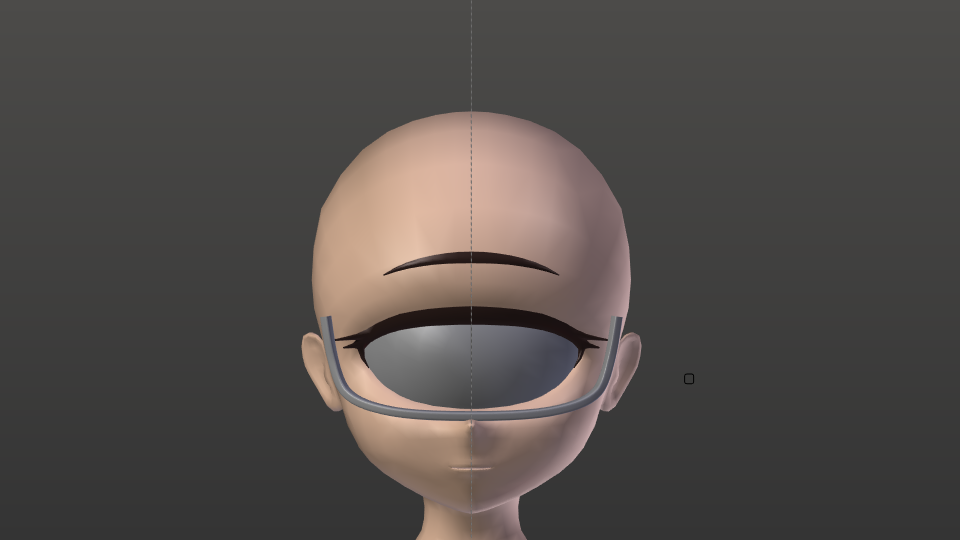
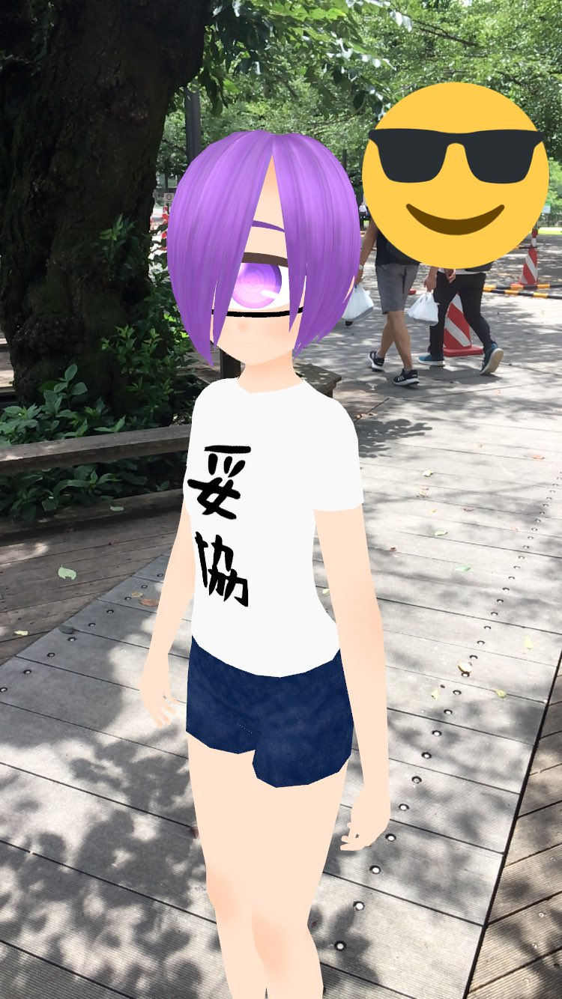

最近全然ブログ更新してなかったんですが、個人的にめちゃくちゃ衝撃的なことがあったので書きます。
春瀬ぽぽさんというVtuberが昨日、数年ぶりに動画を投稿されていました。

<iframe width="560" height="315" src="https://www.youtube.com/embed/2r4jsEyh9QI?si=BUQc3phDEab3NZuZ" title="YouTube video player" frameborder="0" allow="accelerometer; autoplay; clipboard-write; encrypted-media; gyroscope; picture-in-picture; web-share" referrerpolicy="strict-origin-when-cross-origin" allowfullscreen></iframe>

すごく久しぶりにはるぽぽの声を聴いて、いろいろ思い出したので、ブログを書きます。

今回テックブログなどでなくマジの個人の話です。タイトルの通りなんですが、この春瀬ぽぽさんというVtuberの存在によって、私は今エンジニアをしているという話をします。

<https://www.youtube.com/@春瀬ぽぽ>

<https://dic.nicovideo.jp/a/春瀬ぽぽ>

<https://store.line.me/stickershop/product/5065124/ja>

はるぽぽLINEスタンプ好評発売中

## ものづくり

小さいころからずっとものづくりが好きでした。幼稚園・小・中・高とずっと絵を書いたり工作したりしてました。手を動かすことが好きだった。何かを作ることが好きだった。

2017年、高校2年生のクリスマスにデスクトップPCを買ってもらってからは、ぼんやりとプログラミングとかやりたいな～と思うようになり、ドットインストールの無料レッスンでC言語をちょっと学んだりしていました。何もわからないままVirtualBoxとかVagrantを入れた記憶があります。

でもこの頃はまだ実際に何かアプリやゲームを作るといったことはせず、ただ「プログラミングって面白そうだな～」と思っているだけでした。結局PCではゲームをしたり、動画を観たりしているだけでした。

## Vtuber

2017年。そうですね、Vtuberです。PCを持つ前からPSVitaやiPodTouchでニコニコやYoutubeを観ていたため、Vtuber文化には触れていましたが、PCを持ってからは、よりVtuberの動画を観るようになりました。
そんな中で20118年2月、春瀬ぽぽさんがデビューされました。当時ひたすらにVtuberのTwitterアカウントをフォローしまくるbotになっていた私も春瀬ぽぽさんのことはすぐに知りました。

めちゃくちゃ衝撃を受けたのを覚えています。

"単眼系Vtuber"という前例の無いジャンルのVtuberの登場自体も確かに衝撃的でしたが、私が衝撃を受けたのはそこではありません。(ゴリラや触手がVtuberとしてデビューしていたあの時代では、人の形をしている時点で驚きはもう無かった。)

もともと『[モンスター娘のいる日常](https://www.comic-ryu.jp/series/monmusunoirunichijyou/)』や『[ヒトミ先生の保健室](https://www.comic-ryu.jp/series/hitomisenseinohokenshitsu/)』といった作品の影響で単眼キャラが大好きだったのですが、あくまで"好きなだけ"でした。消費者でした。

春瀬ぽぽさんの動画を観て、「ああ、なれるじゃん、単眼に。」と衝撃を受けました。
なれるじゃん、単眼に。なれるじゃん、好きなものに。
個人V乱立全盛期からVtuberを観始めて「みんなすごいな～」と言うだけのタイプでしたが、春瀬ぽぽさんを観た時だけは感想が「俺もVtuberやりたい」でした。

ここからは早かったです。手元にPCがある。学生なら無料で使えるMayaがある(当時のBlenderは使いやすいものでは無かった)。なれるじゃん、単眼に。

そうして見様見真似で3DCGの世界に飛び込みました。

作成途中の3Dモデルのスクショ。これだけHDDの奥底に残ってた。

今見るとひどい出来ですが、当時はこれでも満足していました。下手で、不足していて、五体満足なモデルではありませんでしたが、それでも自分で作った、心のこもったモデルでした。
ここからさらに1年近くかかってしまいましたが、(当時ニコニ立体で配布されていた春瀬ぽぽさんのMMDモデルをめちゃくちゃ参考にしつつ)ちまちまと3DCGを学び、2019年の夏にようやく自分の3Dモデルを完成させました。

<blockquote class="twitter-tweet">
VRChat参戦に向けて準備中...<a href="https://twitter.com/hashtag/VRChat?src=hash&amp;ref_src=twsrc%5Etfw">#VRChat</a> <a href="https://t.co/ohQaQju1mG">pic.twitter.com/ohQaQju1mG</a>
&mdash; 四十物 凛(あいもの りん) (@eye_mono_rin) <a href="https://twitter.com/eye_mono_rin/status/1156482480582512641?ref_src=twsrc%5Etfw">July 31, 2019</a></blockquote> 

当時はeyemono.moeではなく四十物凛になりたがってた。

VRoidモバイルリリース翌日に大学構内でAR撮影した自作モデルの写真。

そんなこんなで3DCGに興味を持ち、サークルでゲーム制作に触れ、プログラミングに触れ、...なんやかんやあって、今はエンジニアとしてうまくやっています。この辺の話はサークルブログに書いています。

<https://trap.jp/post/2239/>

<blockquote class="twitter-tweet">
本日から31日まで、traPは正門付近でビラの配布を行います！新入生の皆様、健康診断の帰りにぜひお受取りください！！ <a href="https://t.co/O7ZYYpk46m">pic.twitter.com/O7ZYYpk46m</a>
&mdash; 東京科学大学デジタル創作同好会traP (@traPisct) <a href="https://twitter.com/traPisct/status/1375953279776137216?ref_src=twsrc%5Etfw">March 27, 2021</a></blockquote> 

比較的まともな3DCGを作れるようになった。

といった感じで、春瀬ぽぽさんが居なかったら、3DCGをやることもなく、エンジニアになることも無く、今の自分は無かったという話でした。
もちろん、春瀬ぽぽさんが居なかったら、それはそれで、他のVtuberやアニメ、漫画などから影響を受けてエンジニアになっていたかもしれません。当時単眼の代わりにゴリラをめちゃくちゃ愛していたら、ゴリラになりて～って言ってたかもしれません。...はるぽぽが居てよかった。

---

数年ぶりの動画投稿ということで、いろいろ思い出したので忘れないうちに書いておきました。自分は結構物忘れが激しくて、自分が何でできているのかさえも結構簡単に忘れてしまいます。だからこそ、定期的にこういうブログを書いて、いつでも振り返れるようにしておきたいなと思います。と、[2か月前にも同じようなことを言ってた](/posts/250503-6nwla5)のに、また2か月も空いてしまいました。次はもう少し早く書きます。
