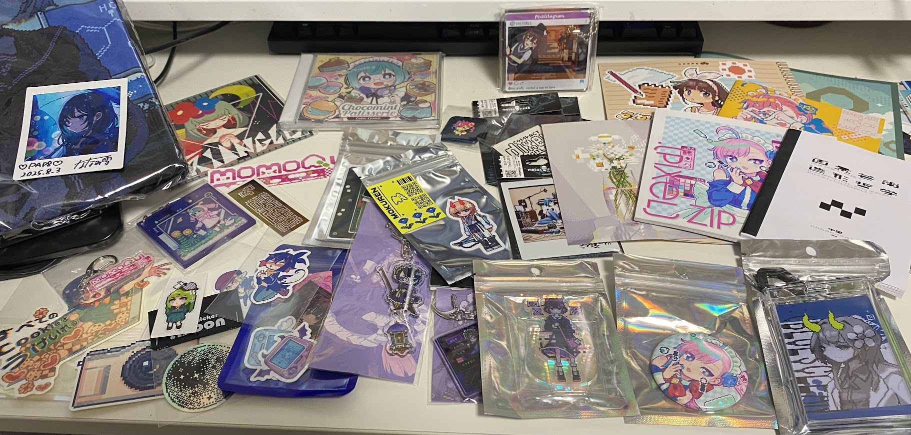
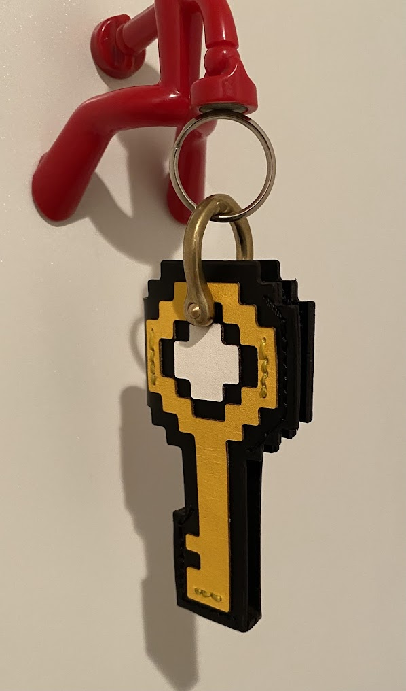
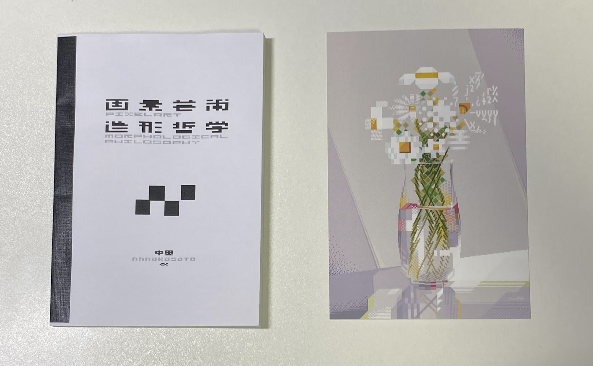
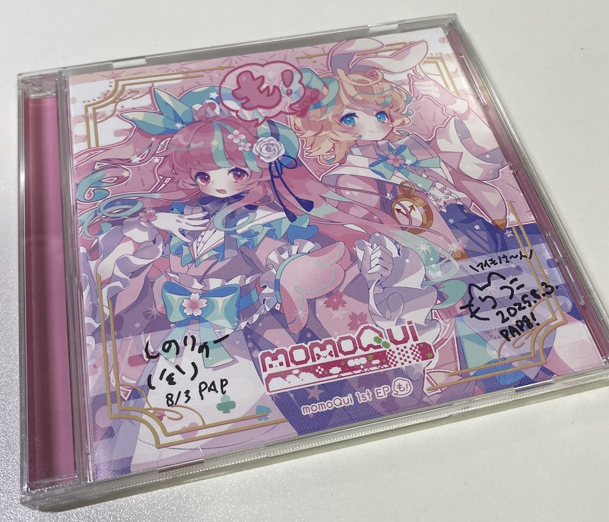
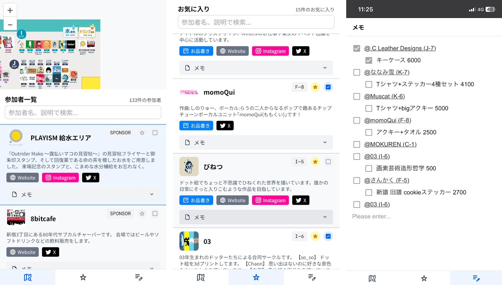
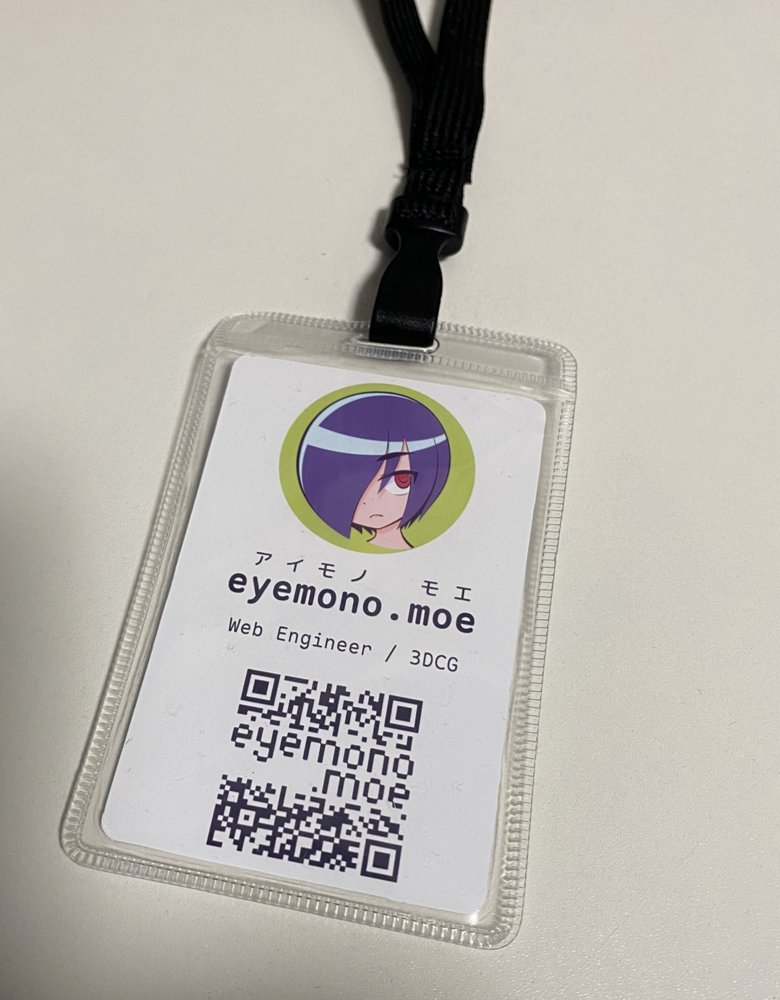

2025/08/03に開催された[PixelArtPark8](https://pixelartpark.com/events/pap8/)に一般参加してきました。PAPの開催は5年ぶり、対面開催は6年ぶりとのことで、出展者も最強、参加者も大量といった感じのイベントでした。

<https://pixelartpark.com/events/pap8/>

## 感想

お迎えしたもの全部に触れるとキリがないので、特に印象に残ったものをいくつか紹介します。ここに上げてないものも素晴らしいものばかりでした。

### [.C Leather Designs](https://x.com/dotclds)さんのキーケース

2年前の[THE PIXEL STREET](https://tpxst.com)で見かけた時からずｔｔｔっと欲しかったものです。ピクストでは知った時点で既に売り切れ、通販でも気づいたときには既に売り切れ、といった感じでタイミングを逃しまくっていましたが、今回ついにお迎えできました。

既に自宅の鍵をセットし、玄関に置いているのですが、毎朝これをインベントリに入れて出勤できるのが嬉しすぎる。事前にTwitterで在庫数が少ないことを伺っており、開場後真っ先に向かいましたが、その時点で既に残り2個とかだったようです。お迎えできて本当に良かった。

### [Muscat](https://x.com/muscat_dot)さんのTシャツ

<blockquote class="twitter-tweet">
Tシャツちょっとだけ作りました！<a href="https://twitter.com/hashtag/PixelArtPark?src=hash&amp;ref_src=twsrc%5Etfw">#PixelArtPark</a> で販売します🚀🌏 <a href="https://t.co/g9eh6PXyI4">https://t.co/g9eh6PXyI4</a> <a href="https://t.co/k5Cg9VzH5h">pic.twitter.com/k5Cg9VzH5h</a>
&mdash; Muscat (@muscat_dot) <a href="https://twitter.com/muscat_dot/status/1947998192781705613?ref_src=twsrc%5Etfw">July 23, 2025</a></blockquote> 

良すぎ～～～

冒頭の写真に写ってませんでしたがお迎えしてます。既に着てたので写っていませんでした。マジでデザインが良すぎる。生地もしっかりしてて良き。

### [Rui8bit](https://x.com/Rui8bit)さんのドット絵

<blockquote class="twitter-tweet">
<a href="https://twitter.com/hashtag/PixelartPark?src=hash&amp;ref_src=twsrc%5Etfw">#PixelartPark</a> C-8 のお品書きです！ 過去作品のポストカードや、アクリルチャームとステッカーを販売します 本日は宜しくお願いします...!<a href="https://twitter.com/hashtag/CAPTURETHEGAMES?src=hash&amp;ref_src=twsrc%5Etfw">#CAPTURETHEGAMES</a> <a href="https://t.co/xoEzp2J8xg">pic.twitter.com/xoEzp2J8xg</a>
&mdash; Rui8bit @PixelArtPark C-8 (@Rui8bit) <a href="https://twitter.com/Rui8bit/status/1951789759233400972?ref_src=twsrc%5Etfw">August 2, 2025</a></blockquote> 

特徴的な色選び、色配置ですよね。ブースで解説していただいたのですが(後から知ったのですが作者のお父様だったようです。ご家族で出展されているの良いですね...)、MSXなどの8bit機の描画形式制約に従ったドット絵を描かれているとのこと。詳しくはご本人のnoteで解説されていました。

<blockquote class="twitter-tweet">
レトロゲーム機の制約に則ったドット絵を描く（ <a href="https://twitter.com/hashtag/MSX?src=hash&amp;ref_src=twsrc%5Etfw">#MSX</a> SCREEN2 ）<a href="https://t.co/4nd111hZ3d">https://t.co/4nd111hZ3d</a> <a href="https://twitter.com/hashtag/note?src=hash&amp;ref_src=twsrc%5Etfw">#note</a>  自身が描く絵について考えている事を、少し字に起こそうと試しました <a href="https://t.co/e7t7AZmNJT">pic.twitter.com/e7t7AZmNJT</a>
&mdash; Rui8bit @PixelArtPark C-8 (@Rui8bit) <a href="https://twitter.com/Rui8bit/status/1877681866603720951?ref_src=twsrc%5Etfw">January 10, 2025</a></blockquote> 

これが制約と誓約か...

### [中里](https://x.com/nnnakasato)さんの『画素芸術造形哲学』

[Rui8bit](https://x.com/Rui8bit)さんのドット絵は"ドット絵"の歩んできた文化・歴史を背景に持つ作品でしたが、対して中里さんの『画素芸術造形哲学』では、その文化・歴史を**一切考慮しない** "ドット"絵 についての分析・考察が行われていました。

<blockquote class="twitter-tweet">
コピー本『画素芸術造形哲学』  解像度という表現形式において「ピクセル」がどのように造形されるか、基礎的な構造や感覚を自分なりに分析したエッセイです。制作指南ではありませんが、視野を広げるヒントになればと思います。  モノクロ/A6サイズ/本文25ページ(約17,000字)<a href="https://twitter.com/hashtag/PixelArtPark?src=hash&amp;ref_src=twsrc%5Etfw">#PixelArtPark</a> <a href="https://t.co/kuHU3bvYhI">https://t.co/kuHU3bvYhI</a> <a href="https://t.co/OFMpc13Hxk">pic.twitter.com/OFMpc13Hxk</a>
&mdash; 中里 8/3 PixelArtPark8【I-6】 (@nnnakasato) <a href="https://twitter.com/nnnakasato/status/1951206331995799562?ref_src=twsrc%5Etfw">August 1, 2025</a></blockquote> 

めちゃくちゃ面白かったです。一つ一つのピクセルが持つ意味、意義、意志の再認識を促されるという点で、Rui8bitさんのドット絵と似た気分を想起させられました。

### [momoQui](https://x.com/_momoQui)さんのサイン貰った

やった～～。お二人ともサインのご快諾ありがとうございました。

実は今日8/3は誕生日だったので日付入りサインもらえたのめちゃくちゃ嬉しい。ななみ雪さんのチェキとかにも日付が書かれててうれし。

ライブもめちゃ良かったです。『週3でカレーが食べたい』の盛り上がりよ。JRNY Bitsに収録されてた『セカイの歩き方』も好きな曲なのでライブで聴けて良かったです。

### 出展情報メモアプリ自作した

毎回こういったイベントの参加時に、出店情報・お品書きをまとめるのに苦労していたので、今回のPixelArtPark8に合わせて出展情報メモアプリを自作しました。シンプルなSPAで、SolidJSで書いています。

主に以下のような機能を持っています：

- マップ画面
  - マップタップでその地点の出展者情報にスクロール
  - 出展者リストタップでその出展配置位置にマップをスクロール
- お気に入り出展者画面
- メモ画面
  - @を使った出展者のサジェスト入力
    - サジェストで入力した出展者名はリンクになり、タップでマップ位置を確認することができるようになっています

特にメモ画面が結構役に立ちました。事前にここに開場直後の流れを書いておいたおかげで、迷わず行動できました。
フロントだけなので出展情報は一旦ハードコードしてますが、今後別イベントでも活用できるように、良い感じにダッシュボードとか作りたいですね。

というかPaaSみたいな感じで公開して、以下ができるようになるといいのかな～とか考えてます。

- 各イベントの主催者がイベント情報設定
- 出展者が出展者情報設定
  - 特にお品書き
- 参加者がマップを閲覧できる

出展者の負担がデカくなってしまいそうですが、少なくともお品書きを一括で確認できる場所はやはり欲しい...その点で今回のPAP8ではカイロソフト非公式Wikiさんがお品書きまとめを作ってくださっていたのが印象的でした。

<https://posfie.com/@kairoparknew/p/LuP1v16>

以前から"クリエイターのプラットフォームを作りたい/支えたい"という気持ちがあって、このメモアプリも将来的にクリエイターの皆さんの活動活性化につながるようなものにしていきたいです。現状はまだ個人用のためコードなど一般公開していませんが、余裕が出来たら一般公開したい。

## まとめ

めちゃくちゃ楽しかったです！！！
次回はぜひ暑くない時期での開催を...！

## おまけ

今回のイベントに合わせて名札を自作したんですが、結局ほとんど使いませんでした。かなしい。

QRコード内に"eyemono.moe"の字を忍ばせています。これはQRコードの誤り訂正に甘えて単に画像を重ねて作成したもの**ではなく**("invalidなピクセル"を意図的に発生させない)、"正しい"QRコードになっています。ほぼ。(3ドット分だけ文字部分をきれいにするために妥協している)

このQRコードの生成には <https://research.swtch.com/qr/draw/> を利用させていただいています。このQRコード中に任意のドット絵を忍ばせる手法の原理については <https://research.swtch.com/qart> で詳しく解説されているのでぜひご覧ください。かみ砕いて説明すると、URLの後にフラグメントとしてめっちゃ長い数字を付け加えることでQRを操作しています。
