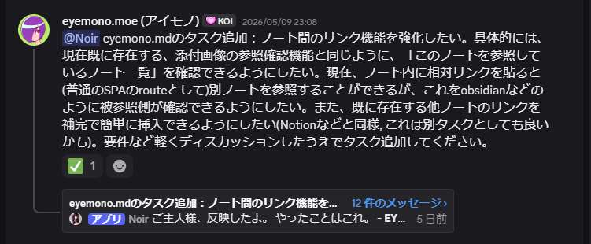
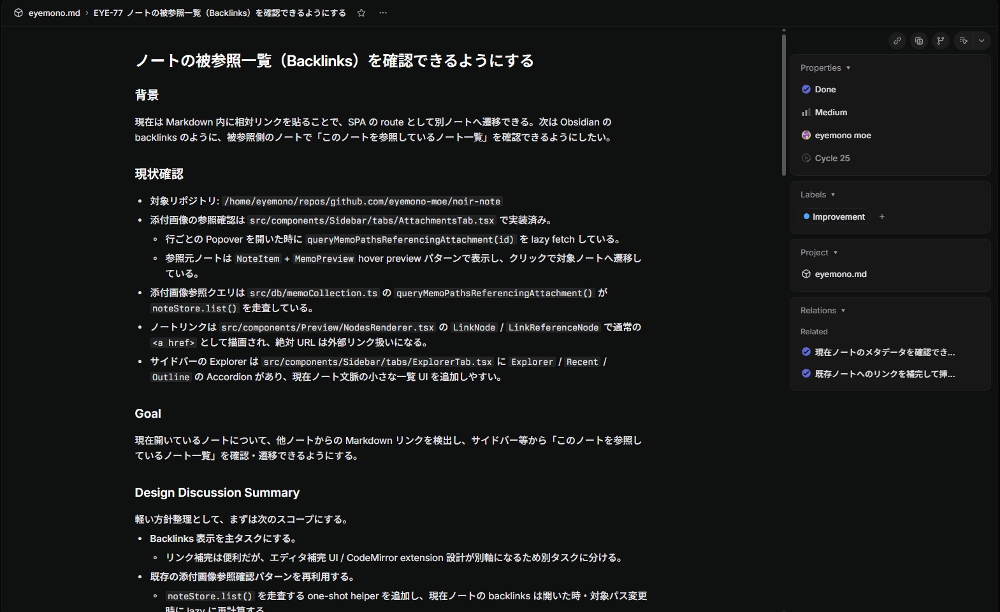
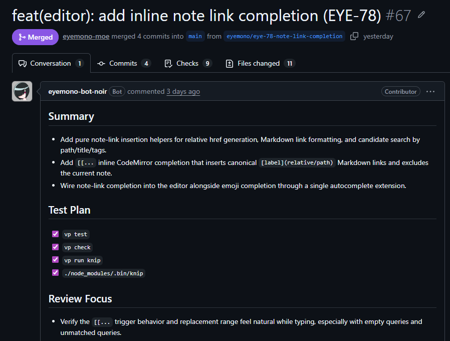

## Streetsとは

Streetsとは、私が開発している**[Nostr](https://welcome.nostr-jp.org)のブラウザ向けクライアント**です。

<https://streets.eyemono.moe>

<https://trap.jp/post/2414/>

2024年の11月にNostrを知ってすぐ開発したクライアントですが、その後数か月で燃え尽きてしまい、約1年以上開発が停止していました。

燃え尽きの原因としては、主に以下の2点が挙げられます。

- なんだかんだ最低限動くものができたので改善のモチベーションが下がった
- NIPsの更新についていくのが大変で、人間が開発するべきでないなと感じた

ただ、LLMによるコーディングが主流となった今の時代であれば、NIPsの更新についていくのもLLMに任せればいいのではないかと思い、再び開発を始めることにしました。
リレー接続やイベントの送受信部分のコアシステム部分についても、年単位で「TanstackDBとかでうまくできねぇかな～」と言い続け、設計だけはずっと練っていたので、重い腰を上げ実装に取り掛かることにしました。

また燃え尽きてしまうのも怖いので、なるべくモチベーションを保てるように、開発日報をつけることにしました。毎日は無理かもしれませんが、できる範囲で続けていきたいと思います。そのうち日報もLLMに書かせます。

## 今日やったこと

### ChatGPTとの設計の壁打ち

ChatGPTとリレー接続やイベントのストアの設計について壁打ちを実施。この時点ではCodexではなくスマホアプリで音声入力使って会話。長文のやり取りは会話に限る。
設計について何となくまとまったのでMarkdownとして出力してもらい、ローカルに落としたうえで改めてhermes-agentに読み込ませて、実装のタスク分解とスケジューリングを実施。

### hermes-agentによるタスク管理

日報というか現在の開発環境紹介になるが、ここ数日は以下の様な環境で開発を進めている。

<blockquote class="twitter-tweet">
特に凝った構成というわけでもないけど今のところこれで個人開発を回している ガンガン金使ってドンドン開発したいってわけではないのでCodexのサブスクリミット内に収まるように4時間毎のcronでタスク消化させている <a href="https://t.co/KBJr7b90fL">pic.twitter.com/KBJr7b90fL</a>
&mdash; eyemono.moe (アイモノ) (@eyemono_moe) <a href="https://twitter.com/eyemono_moe/status/2054252125472137288?ref_src=twsrc%5Etfw">May 12, 2026</a></blockquote> 

**hermes-agent**はNous Researchが開発した、自己改善型AIエージェント。デフォルトでLinearを使ったタスク管理skillがあり、勝手にskillを作ったり更新したりもして便利。

<https://github.com/nousresearch/hermes-agent>

自分はこれをローカルで常に起動して起き、[Messaging Gateway](https://hermes-agent.nousresearch.com/docs/user-guide/messaging/)機能を使ってDiscord経由でやり取りしている。TUIを触ってもいいがDiscordの方が入力が簡単で、スマホからも指示できるので便利。

[個人用に開発しているメモアプリ](https://github.com/eyemono-moe/noir-note)の開発では大体以下の様な流れで実装していた：

#### 1. タスク作成skillでチャットからタスクを作成

「Discordから機能要望を受けたら、実装方針についてディスカッションしたうえでLinearにタスクを生やすskill」を作って使っている

↑agentにご主人様と呼ばせていることがバレる画像。Noirはagentの名前。

するとDiscord上で何度かやり取りした後にこんな感じでLinear側にタスクを生やしてくれる。この時優先度やBlocking設定も同時にやってくれて便利。この会話ではタスクを4つに分解したうえで、それぞれ優先度やrelation,blocking設定をしてくれた。

#### 2. cronでのタスクの実装

[hermes-agentのscheduled tasks機能](https://hermes-agent.nousresearch.com/docs/user-guide/features/cron)を用いて、4時間おきに「Linearから優先度の高いタスクを1つ選んで実装するskill」を動かしている。

すると4時間おきにPRが飛んでくる。このリポジトリではちゃんとテストを書いているのでよっぽどのことが無い限りまともなコードが書かれてくる。不備などがあればまたDiscord上で「#67のPRについて、～～～」などと指示すればその場で直してくれる。

Linearのタスク作成にhookして実装開始するようにしてもいいが、単純にサブスクプランの上限の関係でcronで回している。2時間おきにしたらレビューが間に合わなかった&一瞬で上限に達してしまったので、4時間おきにしている。実装のスピードはタスクの内容にもよるが、だいたい10分程度でPRが上がってくる印象。

---

ということで、Streetsの開発もこのような感じで進められるようにskillやLinearの整備を行った。

### 3. 基盤部分着手開始

早速イベントストアの実装に着手。設計はChatGPTと壁打ちしてある程度固まっているので、あとは実装するだけ。
開発は[v1ブランチ](https://github.com/eyemono-moe/streets/tree/v1)で進めている。方針等一旦雑に[/docs](https://github.com/eyemono-moe/streets/tree/v1/docs)にぶち込んだので気になる人は見てください。正直ちゃんと動くかわからないけど、とりあえず実装してみて、動かなかったらまた燃え尽きることにします。

## やることリスト

- [ ] テスト整備：Streetsにはまともなテストが無いので、テストコードを書く。これが無いとLLMに実装を任せられない。
- [ ] リリースフローの見直し：現在はGithub上でリリースを打った時にブランチを生やすみたいな微妙な運用をしていて、普通にmain merge時にpublishする形にしてしまいたい。同時に、リリースノートも自動生成するようにする。
- [ ] 明日も日報を書く。
